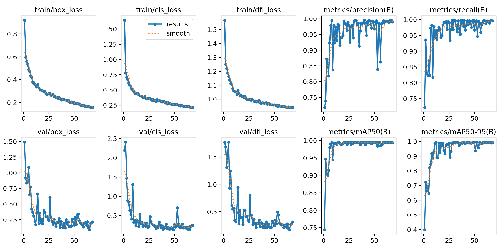
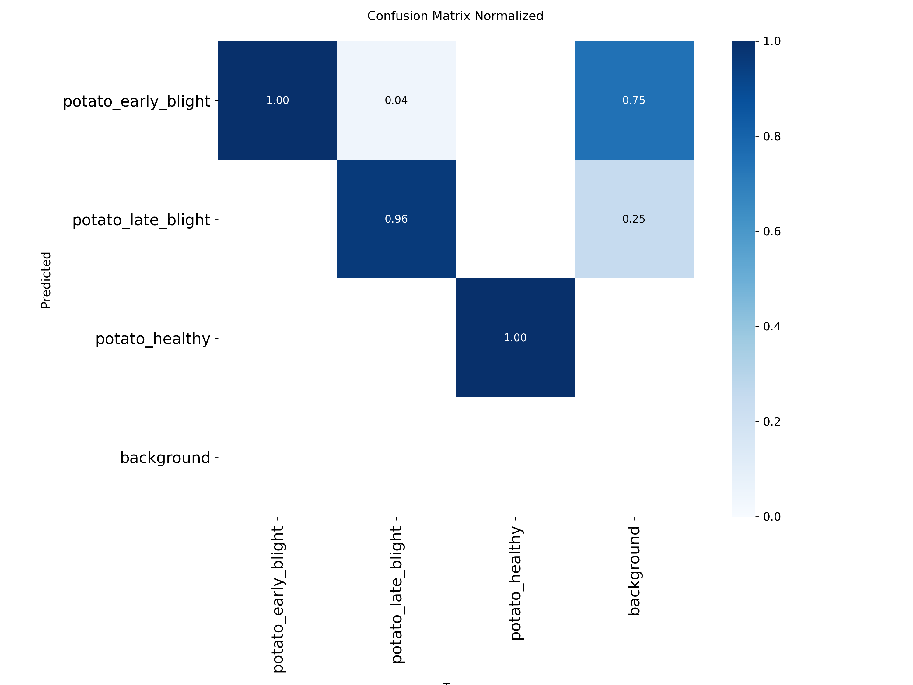
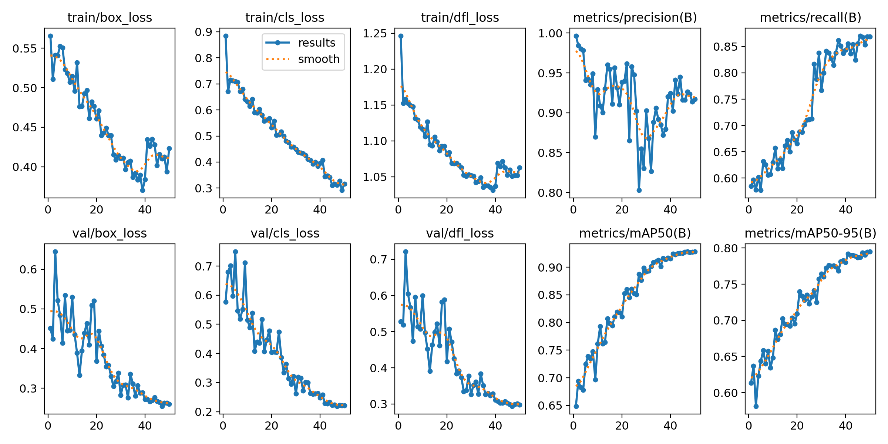
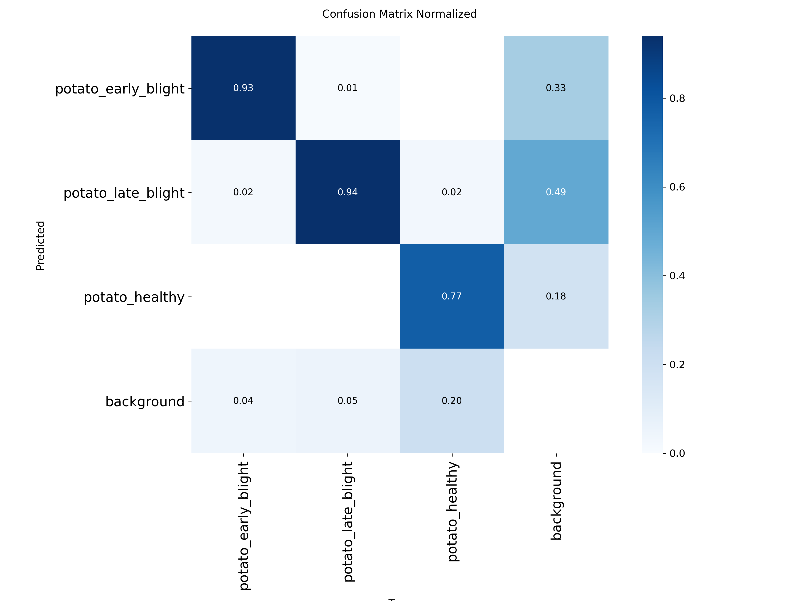

# ML pipeline

Training runs in the cloud. The laptop only ever holds code and the exported
weights. See [`DATASETS.md`](DATASETS.md) for which dataset to train on and why.

## Scope

**Potato only, three classes.**

| Index | Class | Notes |
|---|---|---|
| 0 | `potato_early_blight` | *Alternaria solani* — concentric-ring lesions on lower leaves |
| 1 | `potato_late_blight` | *Phytophthora infestans* — the high-severity, weather-driven one |
| 2 | `potato_healthy` | The minority class, and the one that says "do not spray" |

The index order in `data.yaml` is authoritative and must match
`backend/app/services/taxonomy.py:CLASS_NAMES`. Swapping two lines there
silently mislabels every prediction in production, and nothing will error.

---

## Files

| File | Purpose |
|---|---|
| `notebooks/kaggle_train_potato_yolo.ipynb` | Base training on PlantVillage — run first |
| `notebooks/kaggle_finetune_potato_yolo.ipynb` | Fine-tuning on PlantVillage + field images — run after base |
| `DATASETS.md` | Dataset comparison, imbalance analysis, provenance |
| `prepare_dataset.py` | Stratified, balanced dataset build with per-source eval lists |
| `merge_field.py` | Merges pre-annotated field images into an existing YOLO split |
| `remap_labels.py` | One-time utility — remapped Roboflow class indices to match taxonomy |
| `train_yolo.py` | Training (defaults to yolov8s, 100 epochs) |
| `evaluate.py` | **Lab vs field metrics, reported separately** |
| `tune_thresholds.py` | Per-class confidence thresholds from an asymmetric cost model |
| `benchmark_inference.py` | Measured CPU latency, for the model-size decision |
| `export_onnx.py` | Export + verify the output shape the backend expects |
| `export_feedback.py` | Package expert-validated field cases for the next training run |
| `train_risk_xgb.py` | Optional secondary risk layer — needs real outbreak data |
| `weights/` | Drop `best.onnx`, `thresholds.json` here; gitignored |

---

## Training results

### Run 1 — Base training (PlantVillage only)

**Notebook:** `kaggle_train_potato_yolo.ipynb`  
**Dataset:** PlantVillage (~1200 lab images, capped + oversampled, 1:1 balance)  
**Epochs:** 68/100 (early stopping, patience=25)  
**⚠️ All numbers below are LAB metrics — single leaf, uniform grey background.**

| Class | P | R | mAP50 | mAP50-95 |
|---|---|---|---|---|
| all | 0.982 | 0.985 | 0.995 | 0.995 |
| potato_early_blight | 0.957 | 1.000 | 0.995 | 0.995 |
| potato_late_blight | 1.000 | 0.954 | 0.995 | 0.995 |
| potato_healthy | 0.987 | 1.000 | 0.995 | 0.995 |

Training curves — base run:

Confusion matrix — base run:

---

### Run 2 — Fine-tuning (PlantVillage + field images)

**Notebook:** `kaggle_finetune_potato_yolo.ipynb`  
**Starting weights:** `best.pt` from Run 1  
**Dataset:** PlantVillage (1200 lab) + cropguard-field-potato (343 field images)  
**Epochs:** 50 | **lr0:** 0.001 (10× lower than default to prevent catastrophic forgetting)  

Combined val (lab + field mixed, 254 images):

| Class | P | R | mAP50 | mAP50-95 |
|---|---|---|---|---|
| all | 0.917 | 0.869 | 0.928 | 0.795 |
| potato_early_blight | 0.947 | 0.911 | 0.971 | 0.880 |
| potato_late_blight | 0.906 | 0.904 | 0.942 | 0.800 |
| potato_healthy | 0.897 | 0.793 | 0.871 | 0.705 |

Lab-only val (PlantVillage, 220 images) — confirms no catastrophic forgetting:

| split | mAP50 | mAP50-95 | P | R |
|---|---|---|---|---|
| lab (PlantVillage) | 0.995 | 0.995 | 0.995 | 0.997 |

**Field val note:** The 34 field images in the val split are too few for a
reliable standalone field metric. Next increment: expand field dataset and pass
`--annotated` to `prepare_dataset.py` to get a dedicated field split.

Training curves — fine-tune run:

Confusion matrix — fine-tune run:

---

### Active thresholds (fine-tuned model)

Tuned by `tune_thresholds.py` on 254 mixed val images. Written to
`weights/thresholds.json` and loaded by the backend at startup.

| Class | Threshold | Objective | P | R |
|---|---|---|---|---|
| potato_early_blight | 0.294 | F2 (recall-weighted) | 0.909 | 0.942 |
| potato_late_blight | 0.478 | F2 (recall-weighted) | 0.881 | 0.940 |
| potato_healthy | 0.580 | F0.5 (precision-weighted) | 0.923 | 0.818 |

---

## Design decisions

### Model size: `yolov8s`, not `yolov8n`

Nano is the least accurate variant in the family. Accuracy is what matters when
a wrong answer means the wrong pesticide, so `s` is the default: roughly triple
the parameters (11.2M vs 3.2M) for a real mAP gain, and still inside the CPU
latency budget.

Do not take "still fast enough" on trust — `benchmark_inference.py` measures it
on your hardware and warns if p95 exceeds 1000 ms.

### Augmentation: geometry freely, colour barely

`hsv_h=0.010`, `hsv_s=0.5`, `hsv_v=0.3`, `degrees=15`, `translate=0.10`,
`scale=0.40`, `fliplr=0.5`, `flipud=0.0`, `mosaic=1.0`, `close_mosaic=10`.

Lesion **colour** is the diagnostic signal separating early from late blight.
Aggressive hue jitter teaches the model to ignore exactly the feature that
matters. `flipud=0` because leaves are photographed the right way up.
`close_mosaic=10` runs the final epochs without mosaic so validation resembles
real single-image inference.

### Splits: stratified with exact quotas, deterministic

Random splitting a 152-image class can leave ~15 in val, where a per-class
metric is noise. `stratified_split()` assigns exact per-class quotas ordered
by content hash, reproducible across reruns with no train→val leakage.

### Class balance: measured, capped, oversampled

PlantVillage potato is ~6.5:1 imbalanced against `healthy`. `--cap-train` caps
majority classes in the train split only. `--oversample-min` repeats the
minority up to the majority count. Measured: **6.56:1 → 1.00:1**.

### Thresholds: tuned against an asymmetric cost

The stock `conf=0.25` assumes a false positive and a false negative cost the
same. Here they do not:

| Class | Objective | Reason |
|---|---|---|
| `potato_early_blight` | F2 (recall) | Catch it; triage filters the uncertain ones |
| `potato_late_blight` | F2 (recall) | Fast-moving — a miss costs the field |
| `potato_healthy` | F0.5 (precision) | Only say "healthy" when sure |

### Evaluation: lab and field are never merged into one number

`evaluate.py` reports lab and field splits side by side and warns when the gap
exceeds 0.20 mAP50. With no field split it refuses to present a headline figure
as field accuracy.

---

## Secondary risk layer

`train_risk_xgb.py` exists but ships no model, on purpose. It needs historical
rows linking weather and field context to confirmed outbreaks — CROPSAP
Maharashtra bulletins, ICAR/NCIPM records, or this system's own confirmed cases
once enough exist. It refuses to train below 200 rows and refuses to save a
model below 0.6 AUC, because a model fitted on 30 rows would look like machine
learning and behave like noise.